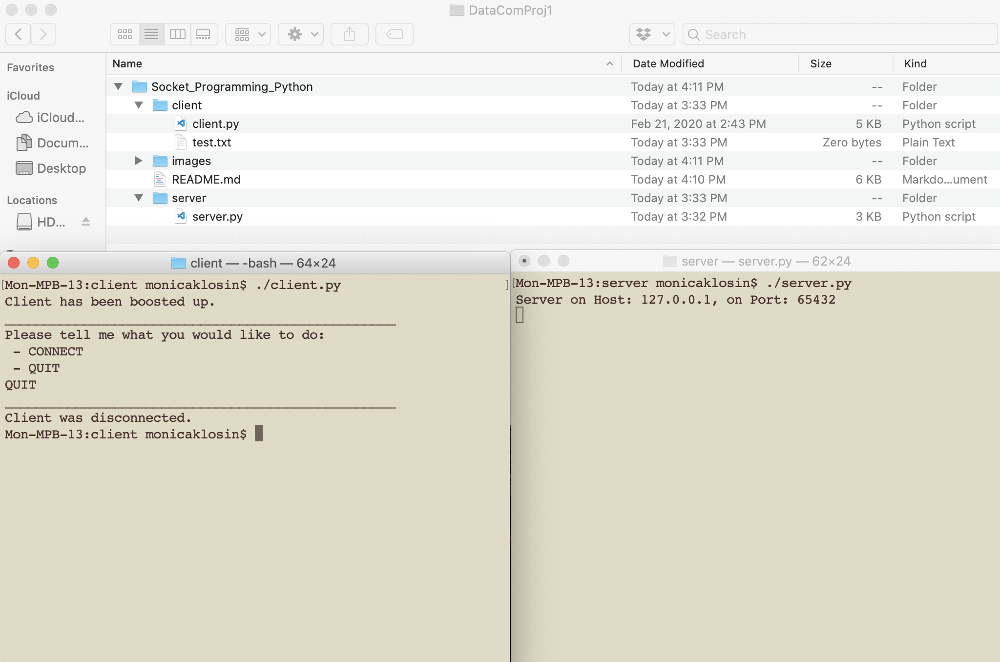

# Socket_Programming_Python
Monica Klosin and Myren Mitchell </br>

The implemented FTP application supports text files transfer. The client program presents a 
command line interface that allows a user to:</br>
-	Connect to a server
-	List files stored at the server.
-	Download (retrieve) a file from the server.
-	Upload (store) a file from the client to the server.
-	Terminate the connection to the server.

___________________________________________________________________________________
When we started the project, we both didn’t know python very well. A lot of our initial information (how loops, print statements, and basic syntax works) came from https://www.learnpython.org/en/Basic_Operators. For this project we started with the basic code from https://realpython.com/python-sockets/.</br>

## CONNECT and QUIT:<br/>

To start, we have a menu seeing if the client wishes to connect or quit. If the user types “QUIT”:

<p align="center">

<br/>
</p>

The client gets disconnected. </br>

If the user wants to CONNECT:

<p align="center">

<br/>
</p>
And the menu pops up. If the CONNECT syntax is entered incorrectly:</br>
<p align="center">

<br/>
</p>
The input menu gets displayed again. </br>

Otherwise, if CONNECT syntax is entered correctly we get this menu:
<p align="center">

<br/>
</p>
Issues we had with CONNECT/QUIT: <br/>
	
With Quit we knew we wanted just a one-word input from the user, but for CONNECT we needed a 3-input phrase. To solve for this:
```
getCommand = input(
           "Please tell me what you would like to do:\n - CONNECT \n - QUIT\n")
getStatement = getCommand.split(" ")
```

We used a split command to take the input statement and turn it into a list separating the three words by the spaces between them. Then we could separate the input into the command, the IP Address, and the port number. </br>


## LIST: </br>
Here we List files from the server on the client side. (Since these were taken on Mac v .DS_Store is a file that stores custom attributes of its containing folder, such as the position of icons or the choice of a background image. ) </br>
<p align="center">

<br/>
</p>

Issues With List: </br>
We had to figure out how to use os.walk and os.listdir in order to get all of the files in the current directory. We figured it out by reading up on these two functions.
It was difficult figuring out how to send the data containing the list of available files over to the client’s side of the connection. This required trial and error learning how sockets pass information to each other. Once we were able to figure this out, it made the later commands much easier to implement. </br>


## STORE: </br>
<p align="center">

<br/>
</p>

If you enter the syntax for STORE incorrectly:

<p align="center">

<br/>
</p>

Issues we had with STORE: </br>
We had many problems to overcome with implementing the Store command including learning how to transfer a file over sockets, writing and creating a new file in Python, and checking to see if a file actually exists in the directory. We had a recurring issue for a while where a new file would be created but the data was not successfully sent over to the server, and the new file would remain blank. We eventually realized that the data was sent over but we were not using the correct method to write the data into the file. We also added an “EOF” marker to the data we sent to let the writer know when it no longer needs to write any more data into the file. We also needed to be able to check if the file the user wanted to store in the server actually exists on the user side, otherwise, a blank file with the name specified is created.

## RETRIEVE: </br>
<p align="center">

<br/>
</p>

If you enter the syntax for STORE incorrectly:
<p align="center">

<br/>
</p>

Issues we had with RETRIEVE: </br>
	We had an error where if we would ask to retrieve a fake file (example fakefile), we would get a blank note of “fakefile” in client, and the server would shut down and we would get a socket.timeout in client.  When I got the socket.timeout fixed with a try/catch, a fake file was still being made. We realized the try catch was merely to see if a message was coming back, not if that file exists or not- ergo the catch where we would break out of the retrieve was never made. We ended up coming up with an if statement instead, and seeing if data.decode != “DNEIS”  (DNEIS being the message that server sends if no file found) then continue retrieving the file. 


## QUIT: </br>
<p align="center">

<br/>
</p>
Issues we had with QUIT: </br>
At first, when the user would enter the Quit command, only the client-side would end the program, and the server would continue to run indefinitely. We added a bit of code that signaled the server to close when the user disconnected. We also had issues with not fully closing and shutting down the sockets properly when we closed the program, making it more difficult to restart the server connection. Once we added the proper socket.shutdown() and socket.close() commands, that issue was resolved.</br>


____________________________________________________________________________________
SOURCES:</br>


https://www.pythoncentral.io/pythons-time-sleep-pause-wait-sleep-stop-your-code/</br>

https://stackoverflow.com/questions/11968976/list-files-only-in-the-current-directory</br>

https://www.bogotobogo.com/python/python_network_programming_server_client_file_transfer.php</br>

https://www.guru99.com/python-check-if-file-exists.html</br>

https://stackabuse.com/python-check-if-a-file-or-directory-exists/</br>

____________________________________________________________________________________
Last Updated:  Feb 23, 2020